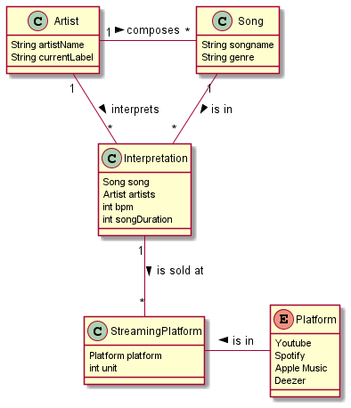
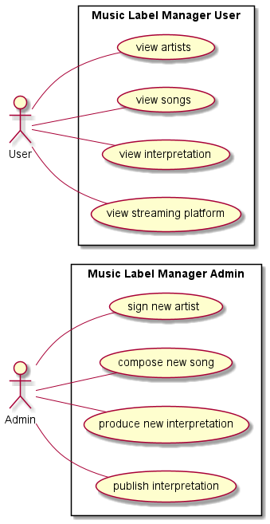

= Projekt Plattenlabel Manager

**Author:** David Ignjatovic

== Beschreibung

Plattenlabel Manager ist ein RestService für ein Plattenlabel.
Das Programm dient zur organisierung und zum Überblick der verschiedenen Lieder.

Man sieht welcher Künstler in dem Label unter vertrag steht und welche lieder er produziert/komponiert hat.
Der User hat die möglichkeit Interpretationen auf eine Platform hochzuladen, wie z.B. Youtube, Spotify, Deezer oder auch Apple Musi.

Jede Interpretation hat eine anzahl an verkauften streams die in Units gemessen wird:

* 1500 streams sind 10 song downloads.
* 10 song downloads sind 1 Album sale.
* 1 Album sale ist 1 Unit.

== Class Diagram

== Use Case Diagram

